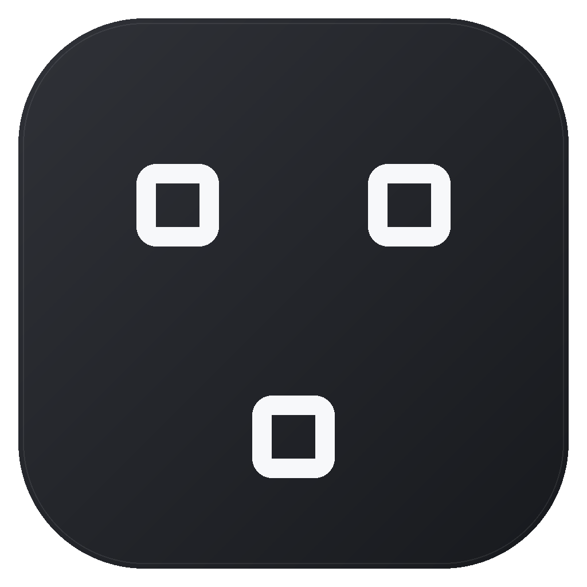

<p align="center">
  
</p>

<h1 align="center">BlockFerry</h1>

<p align="center"><strong>Carry your Minecraft preferences to a new modpack safely — without copying the whole instance.</strong></p>

<p align="center">
  English · <a href="README.zh-CN.md">简体中文</a>
</p>

<p align="center">
  <a href="https://github.com/Rem021/BlockFerry/releases"></a>
  <a href="https://github.com/Rem021/BlockFerry/actions/workflows/ci.yml"></a>
  <a href="LICENSE"></a>
</p>

> [!IMPORTANT]
> `0.1.0-beta.4` is a public beta for Windows 10/11, PCL2, and Minecraft Java 1.21.1. Always review the final migration plan and keep the restore point created by BlockFerry.

## Why BlockFerry?

Moving to a newer modpack often means setting up language, controls, GUI scale, sound levels, JEI bookmarks, and mod preferences all over again. BlockFerry compares a source instance with a target instance, builds a read-only preview, and writes only after you approve the final plan.

It does **not** copy old mod JARs, scripts, worlds, account tokens, launcher databases, or an entire `.minecraft` folder into the new pack.

## What it can migrate

| Area | Current behavior |
| --- | --- |
| Vanilla settings | Field-level merge for language, controls, sound, GUI scale, FOV, and accessibility while preserving target-version structure and resource-pack fields |
| JEI 19.x | Single-player bookmarks and multiplayer bookmarks whose server scope can be identified safely; ambiguous scope is blocked instead of guessed |
| Dark Mode Everywhere 1.x | Current dark-mode state and supported interface preferences |
| Extreme Sound Muffler 3.x | Muting rules in verified formats |
| PCL2 instances | Limited automatic discovery plus manual selection of a PCL root, `.minecraft`, `versions`, or a specific instance directory |
| Safe transactions | Restore point, atomic replacement, SHA-256 verification, interrupted-run recovery, and safe undo |
| Interface | Instant Simplified Chinese/English switching, responsive migration workspace, real task progress, and completion feedback |

Worlds, server lists, login credentials, mod files, KubeJS/scripts, resource-pack files, and launcher account data are intentionally out of scope.

## Download and use

1. Download `BlockFerry-*-win-x64-portable.zip` from [Releases](https://github.com/Rem021/BlockFerry/releases).
2. Extract the ZIP completely; do not run the app from inside the archive.
3. Start `BlockFerry.App.WinUI.exe`. This beta requests Windows administrator approval once so it can preserve protected file metadata safely.
4. Select a source and a target instance, then choose the preferences you want to carry over.
5. Review the generated plan before starting the transaction.

BlockFerry checks the public GitHub Releases API once at startup. It only shows an update link; it never downloads or runs an update automatically. Network errors and rate limits are ignored quietly.

## Safety and privacy

- Discovery, comparison, and preview are read-only for Minecraft/PCL2 instances.
- Real writes require an explicitly approved, generation-bound immutable plan.
- Every target change is backed up, staged, atomically committed, and read back for verification; failures are rolled back.
- No telemetry is collected, and instance paths, settings, bookmarks, server addresses, and device identifiers are never uploaded.
- To identify a JEI LAN/multiplayer scope, BlockFerry may query the Minecraft status endpoint of the last server address found in `latest.log`; it never sends account or login credentials.
- Local app state is stored in `%LOCALAPPDATA%\BlockFerry`, including theme, language, protected recent locations, and recovery/undo records.

See [PRIVACY.md](PRIVACY.md), [SECURITY.md](SECURITY.md), and [TESTING.md](TESTING.md) for the complete boundaries and verification model.

## Build and test

Development requires Windows 10/11, PowerShell 7, .NET SDK `10.0.302` (or a compatible 10.0.x SDK), and Python 3 with `requirements-dev.txt` installed.

```powershell
dotnet run --project tests/BlockFerry.Core.SmokeTests/BlockFerry.Core.SmokeTests.csproj -c Release
dotnet run --project tests/BlockFerry.Pcl2FixtureTests/BlockFerry.Pcl2FixtureTests.csproj -c Release
dotnet run --project tests/BlockFerry.ContentFixtureTests/BlockFerry.ContentFixtureTests.csproj -c Release
dotnet run --project tests/BlockFerry.TransactionFixtureTests/BlockFerry.TransactionFixtureTests.csproj -c Release -r win-x64
dotnet run --project tests/BlockFerry.AppLogicTests/BlockFerry.AppLogicTests.csproj -c Release -r win-x64
dotnet build src/BlockFerry.App.WinUI/BlockFerry.App.WinUI.csproj -c Release -p:Platform=x64 -r win-x64
```

All automated tests use randomized temporary fixtures and must not read or write real Minecraft instances. Windows GitHub Actions repeats the core, discovery, content, transaction, UI contract, formatting, icon, and Release-build gates for pushes and pull requests.

## Contributing

Reproducible bug reports, compatibility samples, translations, and adapter proposals are welcome. Remove usernames, absolute paths, server addresses, tokens, and world data before attaching logs. Follow [SECURITY.md](SECURITY.md) for private vulnerability reporting.

Architecture and adapter rules are documented in [docs/ARCHITECTURE.md](docs/ARCHITECTURE.md) and [docs/ADAPTERS.md](docs/ADAPTERS.md).

## License and trademark

The source code is available under the [Mozilla Public License 2.0](LICENSE). Modified MPL-covered files must remain available under the same license. The `BlockFerry` name and icon are not granted under the source-code license; derivative distributions should use their own name and branding.

BlockFerry is an independent community project. It is not an official Minecraft product and is not approved by, sponsored by, or affiliated with Mojang Studios or Microsoft. Minecraft is a trademark of its respective owner.
